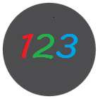

# AlphaTree : DNN && GAN && NLP && BIG DATA    从新手到深度学习应用工程师

从AI研究的角度来说，AI的学习和跟进是有偏向性的，更多的精英是擅长相关的一到两个领域，在这个领域做到更好。而从AI应用工程师的角度来说，每一个工程都可能涉及很多个AI的方向，而他们需要了解掌握不同的方向才能更好的开发和设计。

但是AI中每一个领域都在日新月异的成长。而每一位研究人员写paper的风格都不一样，相似的模型，为了突出不同的改进点，他们对模型的描述和图示都可能大不相同。为了帮助更多的人在不同领域能够快速跟进前沿技术，我们构建了“AlphaTree计划”，每一篇文章都会对应文章，代码，然后进行图示输出。

在面试到一些同学的时候，他们总是信誓旦旦的表示要转深度学习，但是存在能推导公式，但是一到深入理念，或者工程项目细节就两眼一抹黑。有没有一个项目，能一个一个项目帮助大家理解深度学习的发展的同时也提高应用能力。

基于这种想法，邀请了几位资深程序员加入这个项目。希望丰富的资源能够帮助到大家。

版权申明：CC-BY-NC-SA 知识共享-署名-非商业性-相同方式共享
---------------------------------------------------------------------------------------------------

其他：暂时没有精力维护qq群和微信群 ，会定期发布资源到百度网盘，需要资源的可以关注公众号，然后自取

------------------------------------------------------------------------------

## 趣味历史篇：（coming soon）

<table>
    <tr>
      <th></th>
      <th></th>
      <th></th>
      <th></th>
      <th></th>
      <th></th>
    </tr>
    <tr>
      <td align="center"><a href="https://github.com/weslynn/graphic-deep-neural-network/blob/master/storys/1.md">图灵-上</a>     
      <a href="https://github.com/weslynn/graphic-deep-neural-network/blob/master/storys/2.md">图灵-下</a></td>
      <td align="center"><a href="https://github.com/weslynn/graphic-deep-neural-network/blob/master/storys/3.md">Pitts与神经元</a></td>
      <td align="center"><a href="">Frank Rosenblat“两派之争”</a></td>
      <td align="center"><a href="">达特茅斯会议与专家系统</a></td>
      <td align="center"><a href="">John Hopfield与神经网络</a></td>
      <td align="center"><a href="">Geoff Hinton与反向传播</a></td>
    </tr>
    <tr>
      <th></th>
      <th></th>
      <th></th>
      <th></th>
      <th></th>
      <th></th>
    <tr>      
      <td align="center"><a href="">Yann Lecun与手写数字识别</a></td>
      <td align="center"><a href="">LI Feifei与ImageNet</a></td>
      <td align="center"><a href="">AlexNet</a></td>
      <td align="center"><a href="">Google 与GoogleNet</a></td>
      <td align="center"><a href="">何凯明与ResNet</a></td>
      <td align="center"><a href="">机器实现NasNet</a></td>      
    </tr>
</table>

-----------------------------------------------------------------------

## 深度学习基础：物体分类篇object classification [详解 detail](https://github.com/weslynn/AlphaTree-graphic-deep-neural-network/tree/master/DNN%E6%B7%B1%E5%BA%A6%E7%A5%9E%E7%BB%8F%E7%BD%91%E7%BB%9C)

深度学习在解决分类问题上非常厉害。让它声名大噪的也是对于图像分类问题的解决。也产生了很多很经典的模型。其他方向的模型发展很多都是源于这各部分，它是很多模型的基础工作。因此我们首先了解一下它们。

从模型的发展过程中，随着准确率的提高，网络结构也在不断的进行改进，现在主要是两个方向，一是深度，二是复杂度。此外还有卷积核的变换等等。

深度神经网络的发展要从经典的LeNet模型说起，那是1998年提出的一个模型，在手写数字识别上达到商用标准。之后神经网络的发展就由于硬件和数据的限制，调参的难度等各种因素进入沉寂期。

到了2012年，Alex Krizhevsky 设计了一个使用ReLu做激活函数的AlexNet 在当年的ImageNet图像分类竞赛中(ILSVRC 2012)，以top-5错误率15.3%拿下第一。 他的top-5错误率比上一年的冠军下降了十个百分点，而且远远超过当年的第二名。而且网络针对多GPU训练进行了优化设计。从此开始了深度学习的黄金时代。

大家发表的paper一般可以分为两大类，一类是网络结构的改进，一类是训练过程的改进，如droppath，loss改进等。

之后网络结构设计发展主要有两条主线，一条是Inception系列（即上面说的复杂度），从GoogLeNet 到Inception V2 V3 V4，Inception ResNet。 Inception module模块在不断变化，一条是VGG系列（即深度），用简单的结构，尽可能的使得网络变得更深。从VGG 发展到ResNet ，再到DenseNet ，DPN等。 

最终Google Brain用500块GPU训练出了比人类设计的网络结构更优的网络NASNet,最近训出了mNasNet。

此外，应用方面更注重的是，如何将模型设计得更小，这中间就涉及到很多卷积核的变换。这条路线则包括 SqueezeNet，MobileNet V1 V2 Xception shuffleNet等。

ResNet的变种ResNeXt 和SENet 都是从小模型的设计思路发展而来。

输入:图片   输出:类别标签

|模型名 |AlexNet |ZFNet|VGG |GoogLeNet |ResNet|
|:---:|:---:|:---:|:---:|:---:|:---:|
|初入江湖  |2012 |2013 |2014  |2014  |2015|
|层数  |8 |8 |19 |22  |152|
|Top-5错误 |16.4% |11.2%|7.3%  |6.7%  |3.57%|
|Data Augmentation |+ |+ |+ |+ |+|
|Inception(NIN)  |– |– |– |+ |–|
|卷积层数  |5 |5 |16  |21  |151|
|卷积核大小 |11,5,3 | 7,5,3| 3 |7,1,3,5 |7,1,3|
|全连接层数 |3 |3 |3 |1 |1|
|全连接层大小  |4096,4096,1000|4096,4096,1000|4096,4096,1000  |1000  |1000|
|Dropout |+|+|+ |+ |+|
|Local Response Normalization  |+|+|– |+ |–|
|Batch Normalization |–|–|– |– |+|

ILSVRC2016
2016 年的 ILSVRC，来自中国的团队大放异彩：

CUImage（商汤和港中文），Trimps-Soushen（公安部三所），CUvideo（商汤和港中文），HikVision（海康威视），SenseCUSceneParsing（商汤和香港城市大学），NUIST（南京信息工程大学）包揽了各个项目的冠军。

CUImage（商汤科技和港中文）：目标检测第一；
Trimps-Soushen（公安部三所）：目标定位第一；
CUvideo（商汤和港中文）：视频中物体检测子项目第一；
NUIST（南京信息工程大学）：视频中的物体探测两个子项目第一；
HikVision（海康威视）：场景分类第一；
SenseCUSceneParsing（商汤和港中文）：场景分析第一。

其中，Trimps-Soushen 以 2.99% 的 Top-5 分类误差率和 7.71% 的定位误差率赢得了 ImageNet 分类任务的胜利。该团队使用了分类模型的集成（即 Inception、Inception-ResNet、ResNet 和宽度残差网络模块的平均结果）和基于标注的定位模型 Faster R-CNN 来完成任务。训练数据集有 1000 个类别共计 120 万的图像数据，分割的测试集还包括训练未见过的 10 万张测试图像。

ILSVRC 2017
Momenta 提出的SENet 获得了最后一届 ImageNet 2017 竞赛 Image Classification 任务的冠军， 2.251% Top-5 错误率

[模型总览](https://github.com/weslynn/AlphaTree-graphic-deep-neural-network/tree/master/DNN%E6%B7%B1%E5%BA%A6%E7%A5%9E%E7%BB%8F%E7%BD%91%E7%BB%9C) <- 之前展示所有模型的主页挪到这里来了。点这里 点这里

--------------------------------------------------------------------------

模型索引： 

<table>
    <tr>
      <td align="center"><a href="https://github.com/weslynn/AlphaTree-graphic-deep-neural-network/blob/master/DNN%E6%B7%B1%E5%BA%A6%E7%A5%9E%E7%BB%8F%E7%BD%91%E7%BB%9C/object%20classification%20%E7%89%A9%E4%BD%93%E5%88%86%E7%B1%BB/LeNet.md">LeNet</a></td>
      <td align="center"><a href="https://github.com/weslynn/AlphaTree-graphic-deep-neural-network/blob/master/DNN%E6%B7%B1%E5%BA%A6%E7%A5%9E%E7%BB%8F%E7%BD%91%E7%BB%9C/object%20classification%20%E7%89%A9%E4%BD%93%E5%88%86%E7%B1%BB/AlexNet.md">AlexNet</a></td>
      <td align="center"><a href="https://github.com/weslynn/graphic-deep-neural-network/blob/master/DNN%E6%B7%B1%E5%BA%A6%E7%A5%9E%E7%BB%8F%E7%BD%91%E7%BB%9C/object%20classification%20%E7%89%A9%E4%BD%93%E5%88%86%E7%B1%BB/GoogLeNet.md">GoogLeNet</a></td>
      <td align="center"><a href="https://github.com/weslynn/graphic-deep-neural-network/blob/master/DNN%E6%B7%B1%E5%BA%A6%E7%A5%9E%E7%BB%8F%E7%BD%91%E7%BB%9C/object%20classification%20%E7%89%A9%E4%BD%93%E5%88%86%E7%B1%BB/InceptionV3.md">Inception V3</a></td>
      <td align="center"><a href="https://github.com/weslynn/graphic-deep-neural-network/blob/master/DNN%E6%B7%B1%E5%BA%A6%E7%A5%9E%E7%BB%8F%E7%BD%91%E7%BB%9C/object%20classification%20%E7%89%A9%E4%BD%93%E5%88%86%E7%B1%BB/VGG.md">VGG</a></td>
      <td align="center"><a href="https://github.com/weslynn/graphic-deep-neural-network/blob/master/DNN%E6%B7%B1%E5%BA%A6%E7%A5%9E%E7%BB%8F%E7%BD%91%E7%BB%9C/object%20classification%20%E7%89%A9%E4%BD%93%E5%88%86%E7%B1%BB/ResNet.md">ResNet and ResNeXt</a></td>
    </tr>    
    <tr>      
      <td align="center"><a href="https://github.com/weslynn/graphic-deep-neural-network/blob/master/DNN%E6%B7%B1%E5%BA%A6%E7%A5%9E%E7%BB%8F%E7%BD%91%E7%BB%9C/object%20classification%20%E7%89%A9%E4%BD%93%E5%88%86%E7%B1%BB/InceptionResnetV2.md">Inception-Resnet-V2</a></td>
      <td align="center"><a href="https://github.com/weslynn/graphic-deep-neural-network/blob/master/DNN%E6%B7%B1%E5%BA%A6%E7%A5%9E%E7%BB%8F%E7%BD%91%E7%BB%9C/object%20classification%20%E7%89%A9%E4%BD%93%E5%88%86%E7%B1%BB/DenseNet.md">DenseNet</a></td>
      <td align="center"><a href="https://github.com/weslynn/graphic-deep-neural-network/blob/master/DNN%E6%B7%B1%E5%BA%A6%E7%A5%9E%E7%BB%8F%E7%BD%91%E7%BB%9C/object%20classification%20%E7%89%A9%E4%BD%93%E5%88%86%E7%B1%BB/DPN.md">DPN</a></td>
      <td align="center"><a href="https://github.com/weslynn/graphic-deep-neural-network/blob/master/DNN%E6%B7%B1%E5%BA%A6%E7%A5%9E%E7%BB%8F%E7%BD%91%E7%BB%9C/object%20classification%20%E7%89%A9%E4%BD%93%E5%88%86%E7%B1%BB/PolyNet.md">PolyNet</a></td>
      <td align="center"><a href="https://github.com/weslynn/graphic-deep-neural-network/blob/master/DNN%E6%B7%B1%E5%BA%A6%E7%A5%9E%E7%BB%8F%E7%BD%91%E7%BB%9C/object%20classification%20%E7%89%A9%E4%BD%93%E5%88%86%E7%B1%BB/SENet.md">SENet</a></td>
      <td align="center"><a href="">NasNet</a></td>      
    </tr>    
</table>

--------------------------------------------------------------------------

## 深度学习应用

<table>
    <tr>
      <td align="center"><a href="">轻量级模型 & 剪枝</a></td>
      <td align="center"><a href="https://github.com/weslynn/AlphaTree-graphic-deep-neural-network/tree/master/DNN%E6%B7%B1%E5%BA%A6%E7%A5%9E%E7%BB%8F%E7%BD%91%E7%BB%9C/object%20detection%20and%20segmentation%20%E7%89%A9%E4%BD%93%E6%A3%80%E6%B5%8B%E4%B8%8E%E5%88%86%E5%89%B2">物体检测Object Detection </a></td>
      <td align="center"><a href="https://github.com/weslynn/AlphaTree-graphic-deep-neural-network/tree/master/DNN%E6%B7%B1%E5%BA%A6%E7%A5%9E%E7%BB%8F%E7%BD%91%E7%BB%9C/object%20detection%20and%20segmentation%20%E7%89%A9%E4%BD%93%E6%A3%80%E6%B5%8B%E4%B8%8E%E5%88%86%E5%89%B2">物体分割Object Segmentation</a></td>
      <td align="center"><a href="https://github.com/weslynn/AlphaTree-graphic-deep-neural-network/tree/master/DNN%E6%B7%B1%E5%BA%A6%E7%A5%9E%E7%BB%8F%E7%BD%91%E7%BB%9C/OCR%E5%AD%97%E7%AC%A6%E8%AF%86%E5%88%AB">OCR</a></td>
    </tr>   
    <tr>
      <td align="center"><a href="https://github.com/weslynn/AlphaTree-graphic-deep-neural-network/tree/master/DNN%E6%B7%B1%E5%BA%A6%E7%A5%9E%E7%BB%8F%E7%BD%91%E7%BB%9C/face%20detection%20and%20recognition%E4%BA%BA%E8%84%B8%E6%A3%80%E6%B5%8B%E4%B8%8E%E8%AF%86%E5%88%AB">人脸检测Face Detection</a></td>
      <td align="center"><a href="https://github.com/weslynn/AlphaTree-graphic-deep-neural-network/tree/master/DNN%E6%B7%B1%E5%BA%A6%E7%A5%9E%E7%BB%8F%E7%BD%91%E7%BB%9C/face%20detection%20and%20recognition%E4%BA%BA%E8%84%B8%E6%A3%80%E6%B5%8B%E4%B8%8E%E8%AF%86%E5%88%AB">人脸识别Face Recognition</a></td>
      <td align="center"><a href="">肢体检测Pose Detection(coming soon)</a></td>
      <td align="center"><a href="">3D(coming soon)</a></td>      
</table>

物体分类（物体识别）解决的是这个东西是什么的问题（What）。而物体检测则是要解决这个东西是什么，具体位置在哪里（What and Where）。
物体分割则将物体和背景进行区分出来，譬如人群，物体分割中的实例分割则将人群中的每个人都分割出来。
输入:图片   输出:类别标签和bbox(x,y,w,h)

-----------------------------------------------------------------------

## GAN基础

 

参考Mohammad KHalooei的教程，我也将GAN分为4个level，第四个level将按照应用层面进行拓展。 这里基础部分包括Gan的定义，GAN训练上的改进，那些优秀的GAN.具体可以参见 [GAN 对抗生成网络发展总览](https://github.com/weslynn/AlphaTree-graphic-deep-neural-network/tree/master/GAN%E5%AF%B9%E6%8A%97%E7%94%9F%E6%88%90%E7%BD%91%E7%BB%9C)

### GAN的定义 Level 0: Definition of GANs

|Level| Title|  Co-authors| Publication|  Links|
|:---:|:---:|:---:|:---:|:---:|
|Beginner|  GAN : Generative Adversarial Nets|  Goodfellow & et al.|  NeurIPS (NIPS) 2014 |[link](https://papers.nips.cc/paper/5423-generative-adversarial-nets.pdf) |
|Beginner|  GAN : Generative Adversarial Nets (Tutorial)| Goodfellow & et al.|  NeurIPS (NIPS) 2016 Tutorial| [link](https://arxiv.org/pdf/1701.00160.pdf)|
|Beginner|  CGAN : Conditional Generative Adversarial Nets| Mirza & et al.| -- 2014 |[link](https://gist.github.com/shagunsodhani/5d726334de3014defeeb701099a3b4b3) |
|Beginner|  InfoGAN : Interpretable Representation Learning by Information Maximizing Generative Adversarial Nets|  Chen & et al.|  NeuroIPS (NIPS) 2016  ||

模型结构的发展：

--------------------------------------------------------------------------

<table>
    <tr>
      <td align="center"><a href="">CGAN</a></td>
      <td align="center"><a href="">LAPGAN</a></td>
      <td align="center"><a href="">IcGAN</a></td>
      <td align="center"><a href="">ACGAN</a></td>
      <td align="center"><a href="">SemiGan /SSGAN</a></td>
      <td align="center"><a href="">InfoGan</a></td>
    </tr>  
</table>

--------------------------------------------------------------------------

### GAN训练上的改进 Level1：Improvements of GANs training

然后看看 loss、参数、权重的改进：

|Level| Title|  Co-authors| Publication|  Links|
|:---:|:---:|:---:|:---:|:---:|
|Beginner |LSGAN : Least Squares Generative Adversarial Networks  |Mao & et al.|  ICCV 2017|[link](https://ieeexplore.ieee.org/document/8237566)| 
|Advanced |Improved Techniques for Training GANs  |Salimans & et al.| NeurIPS (NIPS) 2016 |[link](https://ceit.aut.ac.ir/http://papers.nips.cc/paper/6125-improved-techniques-for-training-gans.pdf)| 
|Advanced |WGAN : Wasserstein GAN |Arjovsky & et al.| ICML 2017|[link](http://proceedings.mlr.press/v70/arjovsky17a/arjovsky17a.pdf)|
|Advanced |WGAN-GP : improved Training of Wasserstein GANs|  2017|[link](https://arxiv.org/pdf/1704.00028v3.pdf)|
|Advanced |Certifying Some Distributional Robustness with Principled Adversarial Training |Sinha & et al.|ICML 2018|[link](https://arxiv.org/pdf/1710.10571.pdf) [code](https://github.com/duchi-lab/certifiable-distributional-robustness)|

Loss Functions:

## LSGAN(Least Squares Generative Adversarial Networks)

LS-GAN - Guo-Jun Qi, arxiv: 1701.06264

   [2] Mao et al., 2017.4 [pdf](https://arxiv.org/pdf/1611.04076.pdf)

 https://github.com/hwalsuklee/tensorflow-generative-model-collections
 https://github.com/guojunq/lsgan

用了最小二乘损失函数代替了GAN的损失函数,缓解了GAN训练不稳定和生成图像质量差多样性不足的问题。

但缺点也是明显的, LSGAN对离离群点的过度惩罚, 可能导致样本生成的'多样性'降低, 生成样本很可能只是对真实样本的简单模仿和细微改动.

## WGAN
WGAN - Martin Arjovsky, arXiv:1701.07875v1

WGAN：
在初期一个优秀的GAN应用需要有良好的训练方法，否则可能由于神经网络模型的自由性而导致输出不理想。 

为啥难训练？  令人拍案叫绝的Wasserstein GAN 中做了如下解释 ：
原始GAN不稳定的原因就彻底清楚了：判别器训练得太好，生成器梯度消失，生成器loss降不下去；判别器训练得不好，生成器梯度不准，四处乱跑。只有判别器训练得不好不坏才行，但是这个火候又很难把握，甚至在同一轮训练的前后不同阶段这个火候都可能不一样，所以GAN才那么难训练。

https://zhuanlan.zhihu.com/p/25071913

WGAN 针对loss改进 只改了4点：
1.判别器最后一层去掉sigmoid
2.生成器和判别器的loss不取log
3.每次更新判别器的参数之后把它们的绝对值截断到不超过一个固定常数c
4.不要用基于动量的优化算法（包括momentum和Adam），推荐RMSProp，SGD也行

https://github.com/martinarjovsky/WassersteinGAN

## WGAN-GP
Regularization and Normalization of the Discriminator:

WGAN-GP：

WGAN的作者Martin Arjovsky不久后就在reddit上表示他也意识到没能完全解决GAN训练稳定性，认为关键在于原设计中Lipschitz限制的施加方式不对，并在新论文中提出了相应的改进方案--WGAN-GP ,从weight clipping到gradient penalty,提出具有梯度惩罚的WGAN（WGAN with gradient penalty）替代WGAN判别器中权重剪枝的方法(Lipschitz限制)：

[1704.00028] Gulrajani et al., 2017,improved Training of Wasserstein GANs[pdf](https://arxiv.org/pdf/1704.00028v3.pdf)

Tensorflow实现：https://github.com/igul222/improved_wgan_training

pytorch https://github.com/caogang/wgan-gp

## GAN的实现 Level 2: Implementation skill

|Title| Co-authors| Publication|Links| size |FID/IS|
|:---:|:---:|:---:|:---:|:---:|:---:|
|Keras Implementation of GANs|  Linder-Norén| Github  |[link](https://github.com/eriklindernoren/Keras-GAN)|||
|GAN implementation hacks|  Salimans paper & Chintala|  World research  |[link](https://github.com/soumith/ganhacks) [paper](https://ceit.aut.ac.ir/~khalooei/tutorials/gan/#gan-hack-paper-2016)|||
|DCGAN : Unsupervised Representation Learning with Deep Convolutional Generative Adversarial Networks|  Radford & et al.|ICLR 2016  |[link](https://github.com/carpedm20/DCGAN-tensorflow) [paper](https://arxiv.org/pdf/1511.06434.pdf)| 64x64 human||
|ProGAN:Progressive Growing of GANs for Improved Quality, Stability, and Variation|Tero Karras|2017|[paper](https://arxiv.org/pdf/1710.10196.pdf) [link](https://github.com/tkarras/progressive_growing_of_gans)|1024x1024 human|8.04|
|SAGAN：Self-Attention Generative Adversarial Networks| Han Zhang & Ian Goodfellow|2018.05|[paper](https://arxiv.org/pdf/1805.08318.pdf) [link](https://github.com/taki0112/Self-Attention-GAN-Tensorflow)|128x128 obj|18.65/52.52|
|BigGAN:Large Scale GAN Training for High Fidelity Natural Image Synthesis|Brock et al.|ICLR 2019|[demo](https://tfhub.dev/deepmind/biggan-256) [paper](https://arxiv.org/pdf/1809.11096.pdf) [link](https://github.com/AaronLeong/BigGAN-pytorch)|512x512 obj|9.6/166.3|
|StyleGAN:A Style-Based Generator Architecture for Generative Adversarial Networks|Tero Karras|2018|[paper](https://arxiv.org/pdf/1812.04948.pdf) [link]( https://github.com/NVlabs/stylegan)|1024x1024 human|4.04|

指标：

1 Inception Score (IS，越大越好) IS用来衡量GAN网络的两个指标：1. 生成图片的质量 和2. 多样性

2 Fréchet Inception Distance (FID，越小越好) 在FID中我们用相同的inception network来提取中间层的特征。然后我们使用一个均值为 μμ 方差为 ΣΣ 的正态分布去模拟这些特征的分布。较低的FID意味着较高图片的质量和多样性。FID对模型坍塌更加敏感。

FID和IS都是基于特征提取，也就是依赖于某些特征的出现或者不出现。但是他们都无法描述这些特征的空间关系。

物体的数据在Imagenet数据库上比较，人脸的 progan 和stylegan 在CelebA-HQ和FFHQ上比较。上表列的为FFHQ指标。

具体可以参见 [GAN 对抗生成网络发展总览](https://github.com/weslynn/AlphaTree-graphic-deep-neural-network/tree/master/GAN%E5%AF%B9%E6%8A%97%E7%94%9F%E6%88%90%E7%BD%91%E7%BB%9C)

## GAN的应用 Level 3： GANs Applications 

### 3-1 GANs Applications in CV

<table>
    <tr>
      <td align="center"><a href="https://github.com/weslynn/AlphaTree-graphic-deep-neural-network/tree/master/GAN对抗生成网络/Image-translation图像翻译">图像翻译 (Image Translation)</a></td>
      <td align="center"><a href="https://github.com/weslynn/AlphaTree-graphic-deep-neural-network/tree/master/GAN对抗生成网络/Super-Resolution超分辨率">超分辨率 (Super-Resolution)</a></td>
      <td align="center"><a href="https://github.com/weslynn/AlphaTree-graphic-deep-neural-network/tree/master/GAN对抗生成网络/Colourful-Image%20Colorization图像上色%20%20">图像上色(Colourful Image Colorization)</a></td>
    </tr>   
    <tr>
      <td align="center"><a href="https://github.com/weslynn/AlphaTree-graphic-deep-neural-network/blob/master/GAN对抗生成网络/Image%20Inpainting图像修复/README.md"> 图像修复(Image Inpainting)</a></td>
      <td align="center"><a href="https://github.com/weslynn/AlphaTree-graphic-deep-neural-network/tree/master/GAN对抗生成网络/Image-denoising图像去噪">图像去噪(Image denoising)</a></td>
      <td align="center"><a href="https://github.com/weslynn/AlphaTree-graphic-deep-neural-network/tree/master/GAN对抗生成网络/交互式图像生成">交互式图像生成</a></td>   
</table>

特殊领域与应用

<table>
    <tr>
      <td align="center"><a href="https://github.com/weslynn/AlphaTree-graphic-deep-neural-network/tree/master/GAN对抗生成网络/comic-anime-manga漫画">漫画 (comic、anime、manga)</a></td>
      <td align="center"><a href="https://github.com/weslynn/AlphaTree-graphic-deep-neural-network/tree/master/GAN对抗生成网络/face-changing换脸">换脸 (face changing)</a></td>
    </tr>  
</table>

### 3-2 GANs Applications in Video

### 3-3 GANs Applications in NLP/Speech

-------------------------------------------------------------------------------------------

## NLP (comging soon)

-------------------------------------------------------------------------------------------

## BIG DATA(comging soon)

一树一获者，谷也；一树十获者，木也；一树百获者；人也。 希望我们每一个人的努力，能够建立一片森林，为后人投下一片树荫。

每一位加入的作者，都可以选取植物的名称来表示自己，然后logo和名字将会作为自己的署名。

我希望，这终将成为一片森林。

此外，关于深度学习系统中模型结构要怎样设计，特定的任务要不要加入特定的结构和方法，Yann LeCun 和 Christopher Manning 有一个讨论 ，大家可以看一看 https://youtu.be/fKk9KhGRBdI 
雷锋网有介绍 https://www.leiphone.com/news/201804/6l2mAsZQCQG2qYbi.html
